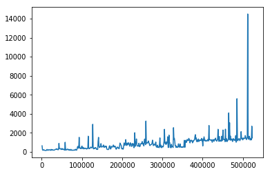
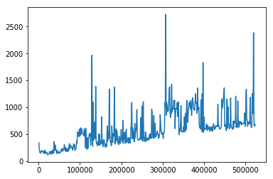

# Лабораторная работа #2

### Задание 1. Исследование кэш-памяти.
Кэш - промежуточный буфер с быстрым доступом, содержащий информацию, которая может быть запрошена с наибольшей вероятностью. Доступ к данным в кэше осуществляется быстрее, чем выборка исходных данных из более медленной памяти или удаленного источника, однако её объём существенно ограничен по сравнению с хранилищем исходных данных.

Необходимо реализовать программу для получения зависимости времени обхода массива от размера массива. Элементы массива имеют тип int.  Для получения времени обхода от размера массива процедуру обхода необходимо многократно повторить (порядка 1000 раз). Изменяйте размер массива от половины размера кэш-памяти первого уровня до полутора размеров кэш-памяти верхнего уровня, чтобы проследить влияние кэш-памяти каждого уровня на среднее время обращения к элементу массива. У каждого процессора свой размер кэш-памяти. Первый обход будет выполняться несколько дольше последующих, т.к. кэш-память еще не заполнена. Такой эффект называется "прогревом кэша". Чтобы получить репрезентативные данные, выполните первый проход без измерения времени. По полученным данным построить графики зависимости среднего времени обращения к элементу массива от размера обрабатываемого массива. На графиках должно быть видно влияние кэш-памяти всех уровней. Из полученных результатов сделать вывод о скорости обхода массива различными способами, о количестве уровней кэш-памяти и об объёмах кэш-памяти каждого уровня. Все графики отобразить на общей сетке для сравнения результата, график добавьте в репозиторий и отобразите в файле `README.md`. 

Реализовать 3 способа обхода массива: 
1. Прямой проход - доступ ко всем элементам идет последовательно, от первого к последнему.
2. Обратный проход - доступ ко всем элементам идет в обратном направлении, от последнего к первому.
3. Случайный проход - доступ происходит в случайном порядке.

Следует компилировать программу с использованием оптимизации (например, c ключами -O1 или -O2), чтобы исключить лишние обращения к памяти. Для замера времени с большей точностью и меньшими накладными расходами используйте функцию `rdtsc`.

  

 
